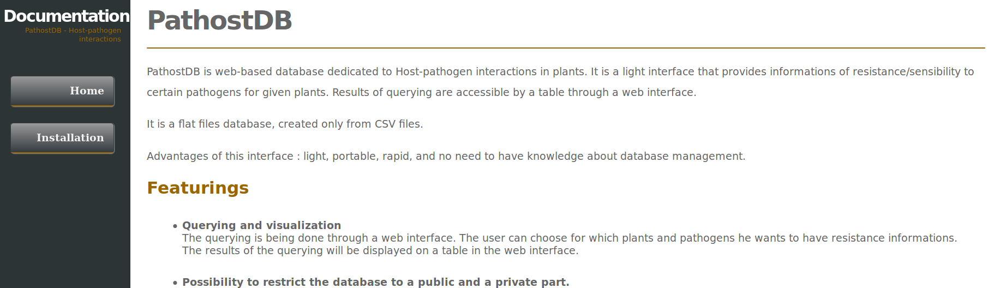

# PathostDB

PathostDB is web-based database dedicated to Host-pathogen interactions in plants. 
It is a light interface that provides informations of resistance/sensibility to certain pathogens for given plants.

## Getting Started with our Wiki

A [wiki](https://mairaxb.github.io/PathostDB/) is available with informations about the software, as well as step by step 
instructions on how to install it.

## Deployment
After installation of the software, the web-based database will be available at : http://localhost/cgi-bin/home.cgi

To change the name of the web instance, configure the Apache server by using an alias. 

## Built With
* [Apache server](https://httpd.apache.org/) - An HTTP server
* [Highcharts](https://www.highcharts.com/) - A JavaScript library used for creation of interactive charts and maps / Creative Commons Attribution Non Commercial Licence
* [Google Maps](https://developers.google.com/maps/documentation/javascript/places) - A JavaScript library used for the integration of google maps into web service / Apache 2 licence

## Authors

* **Khoudia Fall** 
* **Maïra Barca** - [Github](https://github.com/mairaxb)
* **Francois Sabot** - [TOGGLE](https://github.com/francoissabot)
* **Alexis Dereeper** - [Github](https://github.com/dereeper)

## Partners
* [IRD](https://www.ird.fr/) 
* [Africa Rice](http://www.africarice.org/) 
* [CIRAD](https://www.cirad.fr/) 
* [CGIAR](https://www.cgiar.org/)

## License

This project is licensed under the ? License - see the [LICENSE.md](LICENSE.md) file for details
